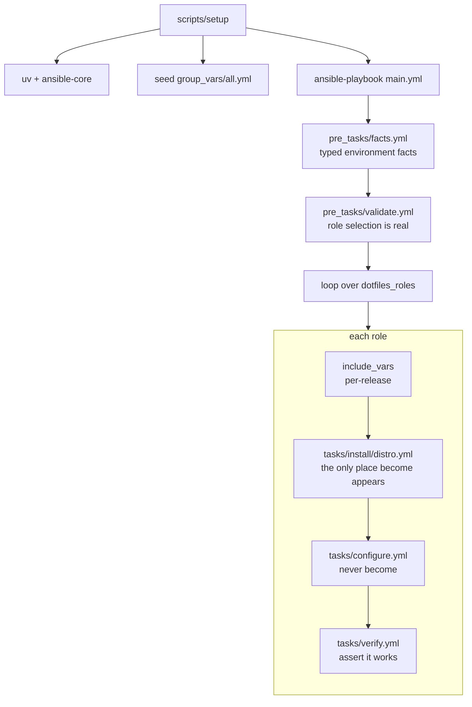

# Architecture

Three ideas do most of the work in this repository.

**Generic and OS-specific work are separated by directory, not by conditional.** Anything touching a package manager or a system path lives in `tasks/install/<distro>.yml`; anything OS-agnostic lives in `tasks/configure.yml`. See [Role layout](roles.md).

**A role must prove it worked.** Every role ends with `tasks/verify.yml`, which asserts the thing it installs is actually present and runnable. This is a structural fix, not a convention: six roles used to download a release archive and never install it, and nothing failed.

**The Windows boundary is explicit.** WSL detection is a typed fact resolved once, and Windows-side work is confined to one role. See [Windows and WSL](wsl.md).

